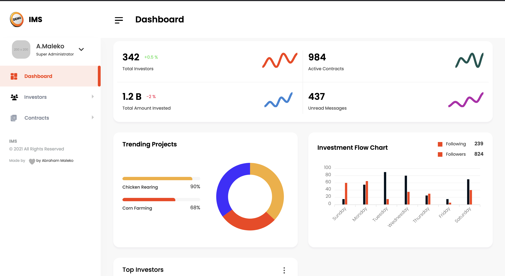
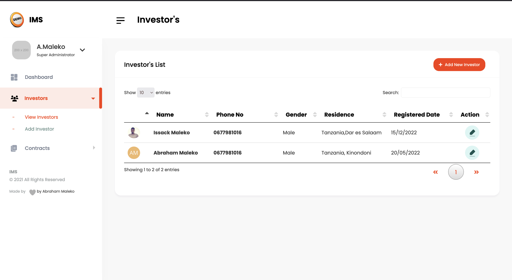
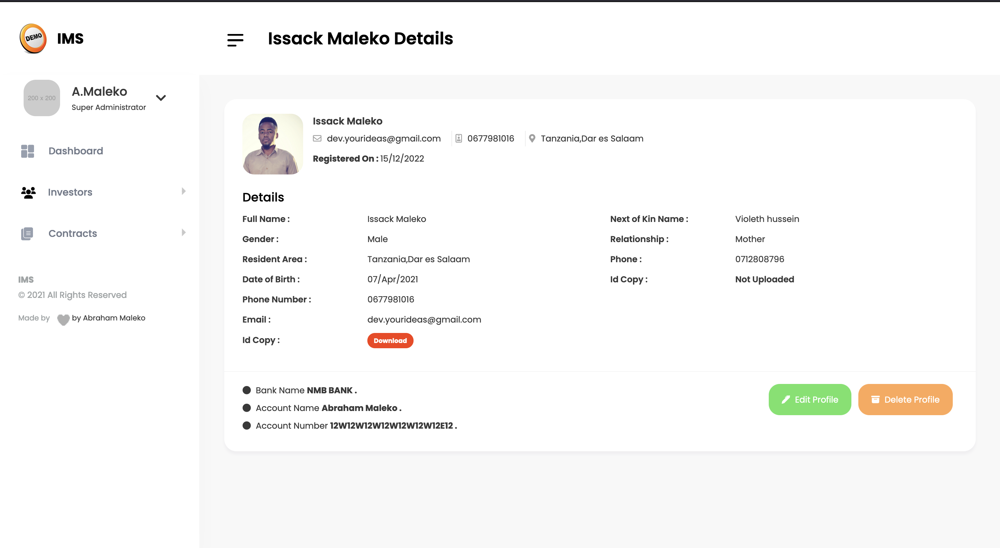

# Investors Management System (IMS)

IMS is a web based systems which aims to facilitate management of Investors which can be used by any Investors Organization you can customize per your own specifics.

## Screenshots
<div style="display:flex;">



</div>

<div style="display:flex; margin-top:1.5rem;">


  
</div>

## Requirements
- Composer installed
- Php 8 +

### HOW TO INSTALL THE APP
- Clone your project into you web server directory
- Composer install
- Rename .env-example to .env and configure your enviroment settings
- Run the migrations

If you prefer to start up the app using pre-data you can run the seeder command which will populate your tables

```
php artisan db:seed
```
## HOW THE SYSTEMS WORKS

Users will be located depending on which branch are designated to and each user will have diffrent permissions which will be assigned by Super Administrator.

In general all users are categorized as follows
- Normal Users
- Administrators
- Super Administrators

### Normal Users
This users have permissions to
- Add Investors Profile 
- Edit Investors Profile 

### Administrators
This users have permissions to
- Add Investors Profile
- Edit Investors Profile
- Add New Contracts (Each branch can add a new contract depending on which contract amount is allowed to) 
- Edit Contract details (Which previously created by its branch) 
- Access to Investors Payment List
- Access to Top Investors,Investors Flow Chart 

### Super Administators
This users have all the administrators priviledges with addition of
- Approve password resets
- Logs 
- Have read,write access to all contracts not bounded by branch


## System Phases
IMS is divided into three phases

1.  Investor Profile
2. Contracts
3.  Admin Dashboard , Reports

### Investor Profile
This phase will have all the investors basic details such as

- Full Name
- Residence Area
- Phone Number
- Email
- DOB
- Investor image
- Copy of ID (Gorverment Issued Id)
- Bank Details
   - Account Name
   - Account Number
   - Bank Name
- Next of Kin
  - Name
  - Relationship
  - Mobile No
  - Copy of ID (Gorvement Issued Id)

### Contracts
This will store the contract details associated with any investor
- Name of Investor
- Amount Invested
- Project invested on
- Contract start date
- Scanned Payment slips
- Scanned Contract Document

### Have Fun Working with IMS

